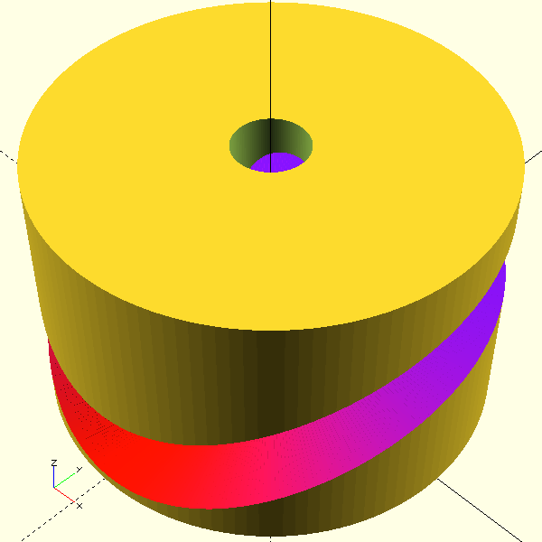

Curved Groove in Cylinder 3d Model
==

Generates a continuous pin in slot cam groove onto a cylinder using your motion formula in OpenSCAD. 
Export into your modeling software. 

A formula like sin(x) is more elegant than splines or jerky turns.
Autodesk Fusion requires [this clumsy process](https://www.youtube.com/watch?v=6ZrHVjxzBK8) to 
extrude onto the surface of a cylinder.
then remove the last 1 degree nib.
Yet the groove walls are not aligned with the bearing.

Next, sliding joint motion tangent to the groove, the bearing,
is unreliable especially over multiple faces.
This groove tends to render as a 1 or 2 faces.
In Fusion, recommend jointing a sphere to the faces.
Alternatively, use your motion formula to simulate joints in something like [pyjoints](https://github.com/phorton1/fusionAddIns-pyJoints).

* TODO: Switch slot thickness from Z height to proper 
perpendicular to surface.


# MegaWave

Fusion and others cannot easily reimport and reprocess a mesh.
Instead import this massive groove once.
Then cut out your dimensioned part natively.



# Use

`wavey` is the curved cylinder shape.
`wavey_groove` cuts that from a shell
to make a grooved cylinder.

`is_prod` tunes mesh quality for editor performance.

```python
use <wavy.scad>;
include <curves.scad>;

// shell_height 
// shell_radius - inner radius
// shell_wall - if < slot_depth, the cylinder is cut in half
// 
// slot_padding - offset from start of cylinder
// slot_range - range of the first wall of the groove
// thickness - between outside walls of slot
// slot_depth
// curve_function - function(angle, slot_range) -> groove_height between 0.0 and 1.0
// sweep_step - slices in 360 degrees
//
// tolerance required to remove remaining edges
// extra_shell
// extra_slices

is_prod = false;
sweep_step = is_prod ? 1 : 10;
$fn = is_prod ? 128 : 60;

wavey_grove(
    shell_height=150,
    shell_radius=50,
    shell_wall=20,
    //
    slot_padding=5,
    slot_range=75,
    thickness=50,
    slot_depth=50,
    curve_function=curve_slowed_peak,
    sweep_step=sweep_step,
    //
    extra_shell=0.5,
    extra_slices=0.1,
);

// or just the curved donut

wavey(
    padding=0,
    slot_range=75,
    radius=75,
    thickness=50,
    depth=10,
    curve_function=curve_slowed_peak,
    sweep_step=sweep_step,
    //
    extra=0.1,
);
```

