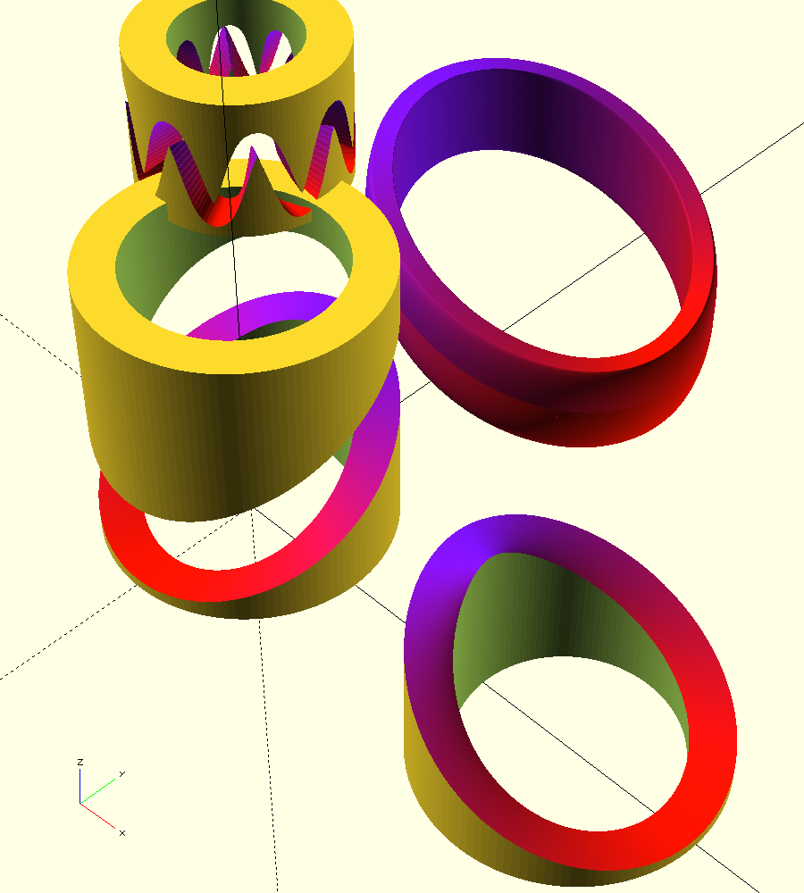

Curved Pin in Slot Cylinder Groove
==

Generates a continuous pin in slot groove onto a cylinder from your motion formula in OpenSCAD. Export into your modeling software. 

Use more elegant math instead of Fusion 360 splines or jerky turns. 
Then avoid the clumsy Thin Extrude > Projection Sketch > Emboss on inner cylinder > Ruled Surface on wall > Thicken cut inside the real shell > Cleanup remaining nib process. All which still fails to make the slot walls straight with the bearing sliding in the groove among other problems.

Those strange sliding faces may or may not cause the next problem:
sliding joint motion in the groove is unreliable in the current version
even with "All Faces". This groove tends to render as a single or small number of faces.
Alternatively, use your motion formula to simulate joint motion in something like [pyjoints](https://github.com/phorton1/fusionAddIns-pyJoints).

